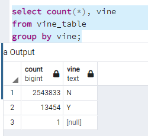
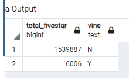
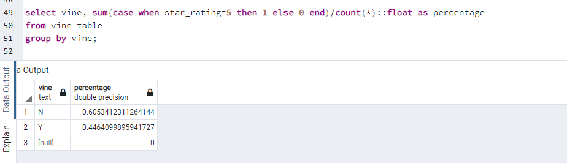

## Overview of the analysis: Explain the purpose of this analysis.

the project is analyzing Amazon reviews written by members of the paid Amazon Vine program. The Amazon Vine program is a service that allows manufacturers and publishers to receive reviews for their products. Companies like SellBy pay a small fee to Amazon and provide products to Amazon Vine members, who are then required to publish a review. Among 50 databases, The Lawn and Garden was chosen for this specific analysis. (the link:amazon_reviews_us_Lawn_and_Garden_v1_00.tsv.gz). The method is PySpark/Colab and pgAdmin. The several tavles extracted from the databases including vine_tables.

## Results: Using bulleted lists and images of DataFrames as support, address the following questions:

### How many Vine reviews and non-Vine reviews were there?
Based on the vina table (unrevised), the number pairVine program and unpaied Vine pregram reviews as follow:

If we consider the revised vine table where we removed null, collecting helpful data, the number of vine aand non vine as follow:

From the table 2, Total number of Vina reviews 386 and non-vine is 48717. te non vine reviews are way more than vine reviews.

### How many Vine reviews were 5 stars? How many non-Vine reviews were 5 stars?

In terms of unrevised data vine_table
 the number as show follow
 

however if we looked at the revised data
the table show the number of vine and non vine -five star reviews as follow:

providing five star among  the vine reviews is 176 and for non vine is 24026. Again the non-vine is outnumbered from vine reviews.

### What percentage of Vine reviews were 5 stars? What percentage of non-Vine reviews were 5 stars?

the percentage of non-vine is about 60% and vine 44%.

## Summary: In your summary, state if there is any positivity bias for reviews in the Vine program. Use the results of your analysis to support your statement. Then, provide one additional analysis that you could do with the dataset to support your statement.

if we hypothesed as tehre is no differences or no bias among the vine and non-vine program in terms of reviews. Based on teh descriptive there is bias in which there are more non-vine reviews prvided five strar compared to the vine reviews. However it need more statistical test in order to generilize .

